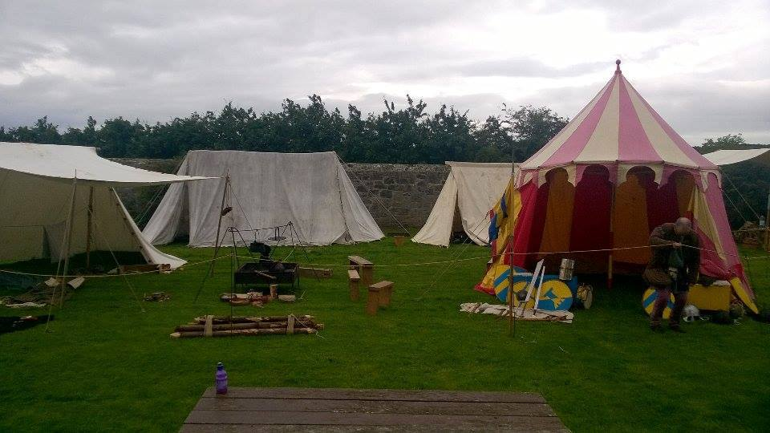
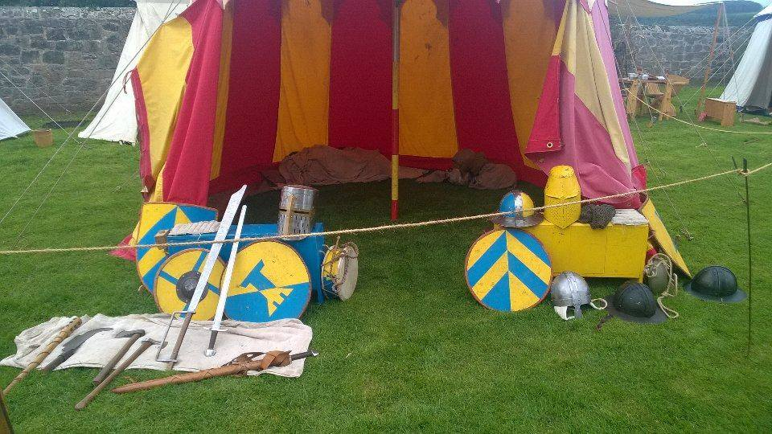
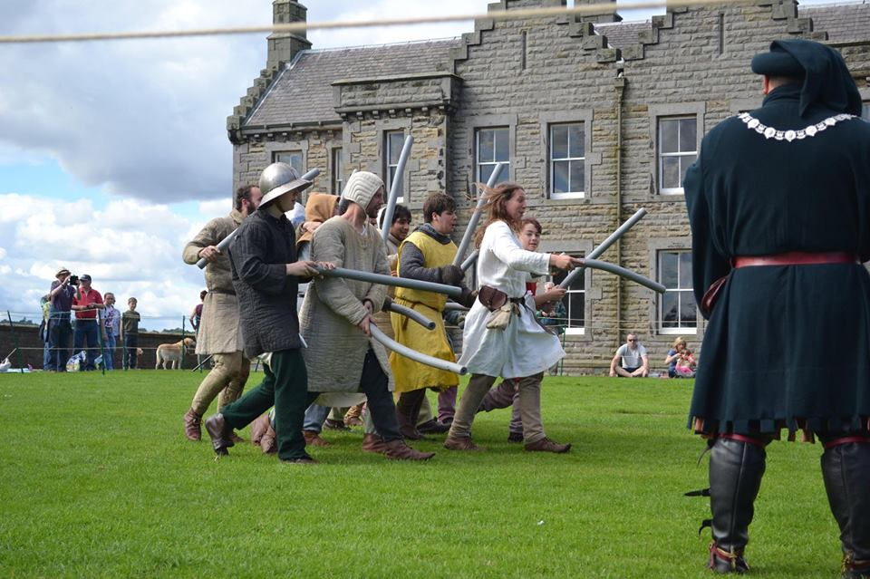
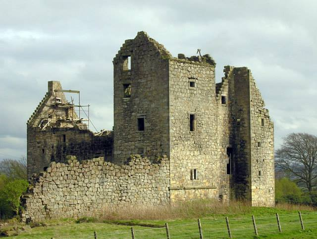

# BXIV
BXIV website
!DOCTYPE html>
<html lang="en">
  <head>
    <meta charset="utf-8">
    <meta name="generator" content="CoffeeCup HTML Editor (www.coffeecup.com)">
    <meta name="dcterms.created" content="Sat, 15 Jul 2017 19:19:38 GMT">
    <meta name="description" content="">
    <meta name="keywords" content="">
	<meta http-equiv="Content-type" content="text/html;charset=UTF-8">
<meta http-equiv="Content-Style-Type" content="text/css">
    <title>BtitanniaXIV</title>
    <meta name="viewport" content="width=device-width, initial-scale=1">
<link rel="stylesheet" href="https://www.w3schools.com/w3css/4/w3.css">

</head>
<body>

  <a class="active" href="BritanniaXIV">Home</a>
  <a href="about.html">Getting Involved</a>
  <a href="Contactus.html">Contact us</a>
  <a href="Groups.html">Groups</a>

 
  
  
  

	
	 
	Britannia XIV is a medieval re-enactment group which aims to recreate the 
	life, crafts and wars of the years 1296 to 1348.

  
  
As a non profit organisation our aims are:
   
   -To offer an educational experience of the early 14th century.
   -To teach historical crafts and keep them in use.
   -To practice a basic form of historical martial art in a manner that gives appreciation of the 
   weapons of the time and as approachable by most.
   -To provide an entertaining and educational experience to the general public via shows and 
   displays.

 
 
 
 
 
 
 

  
  

    Blackness, Camp
  

  
  

    Blackness, armoury
  

  
  

     Blackness, Kids Army
  

  
  

   Torwood Castle
  

<button class="w3-button w3-display-left w3-black" onclick="plusDivs(-1)">&#10094;</button>
<button class="w3-button w3-display-right w3-black" onclick="plusDivs(1)">&#10095;</button>

</body>
</html>
!DOCTYPE html>
<html lang="en">
  <head>
    <meta charset="utf-8">
    <meta name="generator" content="CoffeeCup HTML Editor (www.coffeecup.com)">
    <meta name="dcterms.created" content="Sat, 15 Jul 2017 19:19:38 GMT">
    <meta name="description" content="">
    <meta name="keywords" content="">
	<meta http-equiv="Content-type" content="text/html;charset=UTF-8">
<meta http-equiv="Content-Style-Type" content="text/css">
    <title>BtitanniaXIV</title>
    <meta name="viewport" content="width=device-width, initial-scale=1">
<link rel="stylesheet" href="https://www.w3schools.com/w3css/4/w3.css">

</head>
<body>

  <a class="active" href="BritanniaXIV">Home</a>
  <a href="about.html">Getting Involved</a>
  <a href="Contactus.html">Contact us</a>
  <a href="Groups.html">Groups</a>

 
  
  
  

	
	 
	Britannia XIV is a medieval re-enactment group which aims to recreate the 
	life, crafts and wars of the years 1296 to 1348.

  
  
As a non profit organisation our aims are:
   
   -To offer an educational experience of the early 14th century.
   -To teach historical crafts and keep them in use.
   -To practice a basic form of historical martial art in a manner that gives appreciation of the 
   weapons of the time and as approachable by most.
   -To provide an entertaining and educational experience to the general public via shows and 
   displays.

 
 
 
 
 
 
 

  
  

    Blackness, Camp
  

  
  

    Blackness, armoury
  

  
  

     Blackness, Kids Army
  

  
  

   Torwood Castle
  

<button class="w3-button w3-display-left w3-black" onclick="plusDivs(-1)">&#10094;</button>
<button class="w3-button w3-display-right w3-black" onclick="plusDivs(1)">&#10095;</button>

</body>
</html>
